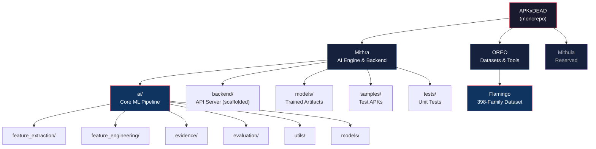
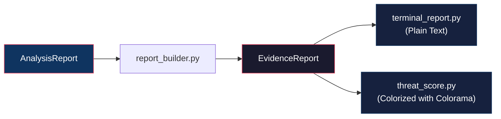
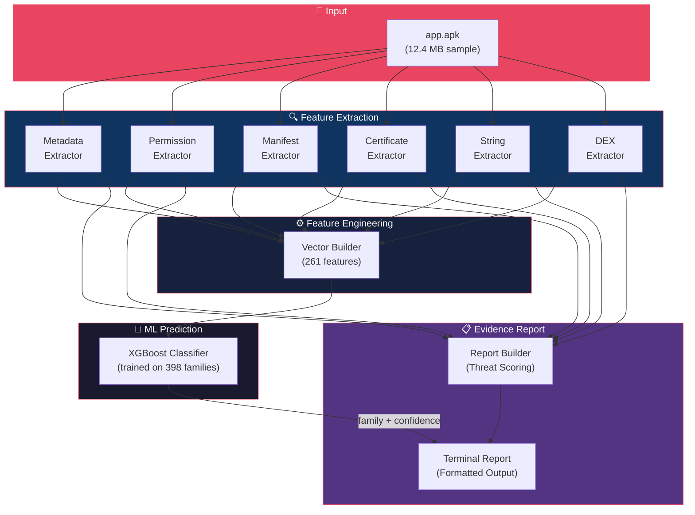
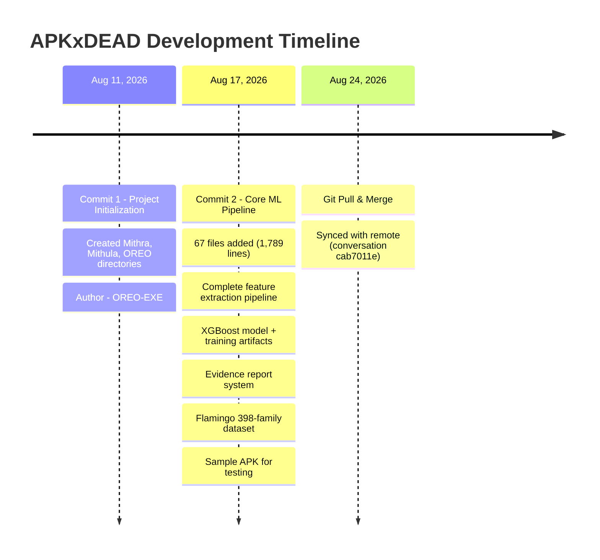

# 🔬 APKxDEAD — Project Analysis Report

> **Report Date:** August 24, 2026  
> **Repository:** [OREO-EXE/APKxDEAD](https://github.com/OREO-EXE/APKxDEAD)  
> **Branch:** `main`  
> **Contributors:** OREO-EXE  
> **Total Commits:** 2

---

## 1. Executive Summary

**APKxDEAD** is an AI-powered Android malware analysis and classification platform. The project's mission is to statically analyze `.apk` files, extract behavioral/structural features, and classify them into known malware families using a trained XGBoost machine learning model.

The project is structured as a **multi-module monorepo** with three top-level components — **Mithra** (the core AI engine), **OREO** (dataset & tooling via the Flamingo sub-project), and **Mithula** (reserved for future work). As of today, the core AI pipeline is functionally complete end-to-end: from APK ingestion → feature extraction → feature engineering → ML prediction → evidence-grade terminal reports.

---

## 2. Repository Architecture

---

## 3. Component Deep Dive

### 3.1 🧠 Mithra — The AI Engine

Mithra is the heart of the project. It contains the complete ML pipeline for Android malware classification.

#### Source Code Metrics

| Module | Files with Code | Total Lines |
|--------|:-:|:-:|
| `ai/feature_extraction/` | 11 | ~467 |
| `ai/feature_engineering/` | 2 | ~149 |
| `ai/evidence/` | 8 | ~366 |
| `ai/` (root: predictor, tests) | 3 | ~93 |
| `tests/` | 1 | ~59 |
| `backend/` | 0 (all scaffolded) | 0 |
| **Total Python** | **25 active** | **~1,134** |

#### 3.1.1 Feature Extraction Pipeline

The feature extraction layer parses real APK files using [Androguard](https://github.com/androguard/androguard) and extracts six categories of forensic data:

| Extractor | File | What It Extracts |
|-----------|------|-----------------|
| **MetadataExtractor** | [metadata_extractor.py](file:///c:/Antigravity/APKxDEAD/Mithra/ai/feature_extraction/metadata_extractor.py) | Package name, app name, version, SDK levels, SHA-256 hash, APK size |
| **PermissionExtractor** | [permission_extractor.py](file:///c:/Antigravity/APKxDEAD/Mithra/ai/feature_extraction/permission_extractor.py) | All declared permissions + flags suspicious ones (SMS, install packages, overlay, etc.) |
| **ManifestExtractor** | [manifest_extractor.py](file:///c:/Antigravity/APKxDEAD/Mithra/ai/feature_extraction/manifest_extractor.py) | Activities, services, broadcast receivers, content providers |
| **CertificateExtractor** | [certificate_extractor.py](file:///c:/Antigravity/APKxDEAD/Mithra/ai/feature_extraction/certificate_extractor.py) | Certificate issuer, subject, SHA-256 (stub — returns empty strings) |
| **StringExtractor** | [string_extractor.py](file:///c:/Antigravity/APKxDEAD/Mithra/ai/feature_extraction/string_extractor.py) | URLs, domains, and IP addresses via regex scanning of raw APK bytes |
| **DexExtractor** | [dex_extractor.py](file:///c:/Antigravity/APKxDEAD/Mithra/ai/feature_extraction/dex_extractor.py) | Total classes/methods, API call frequency, category-wise API counts, suspicious API detection |

All extractors populate a unified [AnalysisReport](file:///c:/Antigravity/APKxDEAD/Mithra/ai/feature_extraction/analysis_report.py) dataclass composed of:
- `MetadataReport` · `PermissionReport` · `ManifestReport` · `CertificateReport` · `StringReport` · `DexReport`

**API Classification System:** The [api_classifier.py](file:///c:/Antigravity/APKxDEAD/Mithra/ai/feature_extraction/api_classifier.py) module categorizes detected API calls into **20 security-relevant categories**:

| Category | Example APIs |
|----------|-------------|
| NETWORK | Socket, HttpURLConnection, OkHttp |
| CRYPTO | Cipher, MessageDigest, SecureRandom |
| SMS | SmsManager, Telephony |
| REFLECTION | Class.forName, Method.invoke |
| DYNAMIC_LOADING | DexClassLoader, PathClassLoader |
| RUNTIME | Runtime.exec, ProcessBuilder |
| ACCESSIBILITY | AccessibilityService |
| CAMERA | Camera, CameraManager |
| LOCATION | LocationManager, Geocoder |
| + 11 more... | Bluetooth, WiFi, Clipboard, Biometric, etc. |

#### 3.1.2 Feature Engineering

The [vector_builder.py](file:///c:/Antigravity/APKxDEAD/Mithra/ai/feature_engineering/vector_builder.py) transforms the raw `AnalysisReport` into a **261-dimensional binary feature vector** that exactly matches the Flamingo training schema. It maps:

| Feature Group | Mapping Logic |
|---------------|--------------|
| **Permissions** (38 features) | `perm_{PERMISSION_NAME}` → binary 0/1 |
| **Code/API Patterns** (52 features) | `code_{API_NAME}` → approximate match against DEX API counts |
| **Behavior Indicators** (62 features) | Rule-based inference from API calls (camera, accessibility, runtime.exec, etc.) |
| **Network Indicators** (25 features) | URL/domain presence triggers `net_http_tunnel` |
| **Native Libraries** (46 features) | Placeholder — ready for APK lib/ scanning |
| **Obfuscation** (33 features) | Hardcoded to `total_obfuscation = 3` (matching training data) |
| **Aggregate Counts** (4 features) | `total_permissions`, `total_behaviors`, `total_native_libs`, `total_obfuscation` |

#### 3.1.3 ML Prediction Engine

The [predictor.py](file:///c:/Antigravity/APKxDEAD/Mithra/ai/predictor.py) module loads and serves a pre-trained **XGBoost classifier**:

| Artifact | File | Description |
|----------|------|-------------|
| Model | [apk_malware_model.json](file:///c:/Antigravity/APKxDEAD/Mithra/models/apk_malware_model.json) | XGBoost classifier (3.3 MB, JSON format) |
| Label Encoder | [label_encoder.pkl](file:///c:/Antigravity/APKxDEAD/Mithra/models/label_encoder.pkl) | scikit-learn LabelEncoder mapping prediction IDs → family names |
| Feature Schema | [feature_columns.json](file:///c:/Antigravity/APKxDEAD/Mithra/models/feature_columns.json) | Ordered list of 261 feature column names |

**Prediction output** includes:
- `family` — Predicted malware family name
- `confidence` — Probability score (0.0–1.0)
- `prediction_id` — Numeric class label

#### 3.1.4 Evidence Report System

A full forensic-grade report is generated through the evidence subsystem:

The [EvidenceReport](file:///c:/Antigravity/APKxDEAD/Mithra/ai/evidence/evidence_report.py) is a 10-section dataclass covering:

| Section | Contents |
|---------|----------|
| **Executive Summary** | App name, package, risk level, threat score |
| **APK Information** | Version, SDK levels, SHA-256, file size |
| **Permissions** | Total count + list of dangerous permissions |
| **Manifest** | Component counts (activities, services, receivers, providers) |
| **Certificate** | Issuer, subject, cert hash |
| **DEX Analysis** | Class/method counts, API category breakdown, top APIs, suspicious APIs |
| **Network Indicators** | URLs, domains, IPs found in APK |
| **Behavior Analysis** | Detected behavioral patterns |
| **IOCs** | Indicators of Compromise (hashes, URLs, domains, IPs) |
| **Recommendation** | Risk verdict, threat score /100, actionable recommendation |

**Threat Scoring Algorithm** ([report_builder.py](file:///c:/Antigravity/APKxDEAD/Mithra/ai/evidence/report_builder.py)):
- Each dangerous permission: **+10 points**
- Network API calls: **+1 per 100 calls**
- Crypto API calls: **+1 per 25 calls**
- Each suspicious API: **+5 points**
- Capped at **100/100**

| Score Range | Risk Level | Verdict |
|:-:|:-:|:-:|
| 0–19 | LOW | Likely Safe |
| 20–39 | MEDIUM | Review Recommended |
| 40–69 | HIGH | Potentially Malicious |
| 70–100 | CRITICAL | Do Not Install |

---

### 3.2 🦩 OREO/Flamingo — The Training Dataset

The [Flamingo](file:///c:/Antigravity/APKxDEAD/OREO/Flamingo/README.md) sub-project is a comprehensive synthetic dataset used to train the XGBoost model.

#### Dataset Statistics

| Metric | Value |
|--------|-------|
| **Total Families** | 398 |
| **Categories** | 15 |
| **Feature Dimensions** | 268 |
| **Training Samples** | 398 rows × 268 features |

#### Category Distribution

| Category | Count | | Category | Count |
|----------|:-----:|-|----------|:-----:|
| Trojan | 95 | | CryptoMiner | 16 |
| Adware | 49 | | Rootkit | 12 |
| Spyware | 46 | | Lockscreen | 12 |
| Banker | 41 | | Backdoor | 9 |
| RAT | 36 | | Worm | 9 |
| Ransomware | 25 | | Riskware | 4 |
| SMS_Trojan | 24 | | PUA | 2 |
| InfoStealer | 18 | | | |

#### Feature Space Breakdown (268 dimensions)

| Feature Group | Count | Prefix |
|---------------|:-----:|--------|
| Permissions | 38 | `perm_` |
| Behavioral Patterns | 62 | `beh_` |
| Network Indicators | 25 | `net_` |
| Code/API Patterns | 52 | `code_` |
| Native Library Signatures | 46 | `native_` |
| Obfuscation Techniques | 33 | `obf_` |
| Aggregate Counts | 4 | `total_` |

#### Flamingo Tooling

| File | Lines | Purpose |
|------|:-----:|---------|
| [generate.js](file:///c:/Antigravity/APKxDEAD/OREO/Flamingo/generate.js) | 644 | Dataset generator — creates all CSV/JSON files from family definitions |
| [extract_features.js](file:///c:/Antigravity/APKxDEAD/OREO/Flamingo/extract_features.js) | 542 | Real APK feature extractor (Node.js, uses apktool for decompilation) |

---

### 3.3 Mithula — Reserved

The `Mithula/` directory contains only a `.gitkeep` file. It is reserved for future development.

---

### 3.4 Backend — Scaffolded

The `Mithra/backend/` directory has four empty placeholder files:

| File | Status |
|------|--------|
| [config.py](file:///c:/Antigravity/APKxDEAD/Mithra/backend/config.py) | Empty |
| [main.py](file:///c:/Antigravity/APKxDEAD/Mithra/backend/main.py) | Empty |
| [routes.py](file:///c:/Antigravity/APKxDEAD/Mithra/backend/routes.py) | Empty |
| [schemas.py](file:///c:/Antigravity/APKxDEAD/Mithra/backend/schemas.py) | Empty |

> [!NOTE]
> The backend API server is fully scaffolded with the right file structure but has zero implementation. This is the natural next step for exposing Mithra's capabilities as a REST API.

---

## 4. End-to-End Data Flow

---

## 5. Testing Infrastructure

| Test File | Purpose | Status |
|-----------|---------|:------:|
| [test_predictor.py](file:///c:/Antigravity/APKxDEAD/Mithra/ai/test_predictor.py) | Smoke test — runs prediction on a zero-vector | ✅ Implemented |
| [test_real_apk.py](file:///c:/Antigravity/APKxDEAD/Mithra/ai/test_real_apk.py) | Integration test — full pipeline on `samples/app.apk` | ✅ Implemented |
| [test_dex.py](file:///c:/Antigravity/APKxDEAD/Mithra/ai/feature_extraction/test_dex.py) | DEX extraction standalone test | ✅ Implemented |
| [test_reports.py](file:///c:/Antigravity/APKxDEAD/Mithra/tests/test_reports.py) | Unit tests for MetadataExtractor and report builder | ✅ Implemented (2 tests) |
| `tests/test_manifest.py` | Placeholder | ⬜ Empty |
| `tests/test_metadata.py` | Placeholder | ⬜ Empty |

---

## 6. Git History Timeline

---

## 7. Technology Stack

| Layer | Technology |
|-------|-----------|
| **Language** | Python 3, JavaScript (Node.js) |
| **ML Framework** | XGBoost (model), scikit-learn (LabelEncoder) |
| **APK Analysis** | Androguard (Python), apktool (via Node.js) |
| **Data Processing** | pandas, joblib |
| **Terminal UI** | colorama (colored threat reports) |
| **Dataset Format** | CSV, JSON |
| **Version Control** | Git, GitHub |
| **Backend (planned)** | Scaffolded (likely FastAPI based on file structure) |

---

## 8. What's Been Accomplished ✅

| # | Milestone | Details |
|:-:|-----------|---------|
| 1 | **Project Architecture** | Clean monorepo with Mithra (AI), OREO (data), Mithula (future) separation |
| 2 | **Flamingo Dataset** | 398 malware families across 15 categories with 268-feature binary vectors |
| 3 | **Dataset Tooling** | JS-based dataset generator (`generate.js`) and APK feature extractor (`extract_features.js`) |
| 4 | **6 Feature Extractors** | Metadata, permissions, manifest, certificate, strings, DEX — all wired to unified AnalysisReport |
| 5 | **20-Category API Classifier** | Security-focused API taxonomy covering network, crypto, SMS, reflection, dynamic loading, etc. |
| 6 | **261-Feature Vector Builder** | Transforms raw analysis into ML-ready feature vector matching training schema |
| 7 | **Trained XGBoost Model** | Pre-trained classifier with label encoder and feature schema, ready for inference |
| 8 | **ML Predictor** | Load-and-predict module returning family name, confidence, and prediction ID |
| 9 | **Evidence Report System** | 10-section forensic report with threat scoring (0-100), risk levels, and actionable recommendations |
| 10 | **Terminal Report Renderers** | Plain text + colorized (colorama) report formatters |
| 11 | **Sample APK** | 12.4 MB real APK file for integration testing |
| 12 | **Test Suite** | 4 test scripts covering predictor smoke test, real APK integration, DEX extraction, and report generation |
| 13 | **Backend Scaffold** | Directory structure ready for API server implementation |

---

## 9. What's Not Yet Done ⬜

| # | Gap | Priority | Notes |
|:-:|-----|:--------:|-------|
| 1 | **Backend API Server** | 🔴 High | `config.py`, `main.py`, `routes.py`, `schemas.py` are all empty |
| 2 | **Certificate Extraction** | 🟡 Medium | `CertificateExtractor` is a stub — returns empty strings |
| 3 | **Native Library Detection** | 🟡 Medium | `vector_builder.py` has placeholder logic — all native features hardcoded to 0 |
| 4 | **Evaluation Module** | 🟡 Medium | `evaluation/` has empty files: `confusion_matrix.py`, `metrics.py`, `roc.py`, `shap_analysis.py` |
| 5 | **Requirements File** | 🟠 Low | `requirements.txt` is empty — dependencies not documented |
| 6 | **README** | 🟠 Low | `Mithra/README.md` is empty |
| 7 | **`.gitignore`** | 🟠 Low | `Mithra/.gitignore` is empty |
| 8 | **Utility Modules** | 🟠 Low | `utils/hashing.py`, `utils/helpers.py`, `utils/logger.py` are empty |
| 9 | **Test Coverage Gaps** | 🟠 Low | `test_manifest.py`, `test_metadata.py` are empty placeholders |
| 10 | **Mithula Module** | ⚪ TBD | Entirely empty — purpose undefined |

---

## 10. Code Quality Observations

> [!TIP]
> **Strengths**
> - Clean separation of concerns across modules
> - Consistent use of Python dataclasses for data models
> - Well-structured extractor pattern (each extractor populates a section of `AnalysisReport`)
> - Feature vector builder carefully maintains training schema compatibility
> - Two-layer report system (raw AnalysisReport → polished EvidenceReport)
> - Noise API filtering in DEX analysis removes common framework boilerplate

> [!WARNING]
> **Areas for Improvement**
> - **Duplicate code**: `evidence/evidence/` nested directory contains partial duplicates of `evidence/` modules
> - **Duplicate filename**: Both `behaviour_summary.py` and `behavior_summary.py` exist (one is a shim, one is empty)
> - **Hardcoded obfuscation**: `total_obfuscation = 3` is hardcoded rather than dynamically detected
> - **Return type mismatch**: `vector_builder.py` declares return type `Dict[str, Any]` but `test_real_apk.py` calls `.shape` and `.columns` on it (expects DataFrame)
> - **Certificate extraction**: Completely stubbed out, reducing forensic completeness

---

## 11. Total Project Size

| Metric | Value |
|--------|------:|
| Python source files (non-empty) | 27 |
| Python lines of code | ~1,134 |
| JavaScript source files | 2 |
| JavaScript lines of code | ~1,186 |
| Dataset files (CSV/JSON) | 4 |
| Dataset size | ~816 KB |
| ML model artifacts | 3 files (~3.3 MB) |
| Sample APK | 1 file (12.4 MB) |
| **Total project files** | **~70** |
| **Total lines of code** | **~2,320** |

---

> [!IMPORTANT]
> **Bottom Line:** APKxDEAD has a solid, working AI-powered Android malware classification pipeline. The core loop — *parse APK → extract features → predict malware family → generate threat report* — is functional end-to-end. The most impactful next step would be implementing the backend API server to make this pipeline accessible as a web service, followed by completing the certificate extractor and native library detection to improve classification accuracy.
